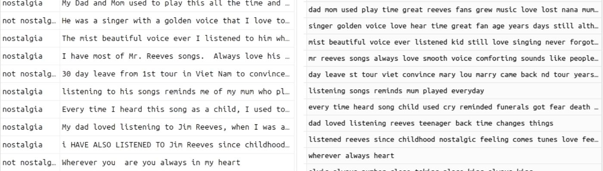
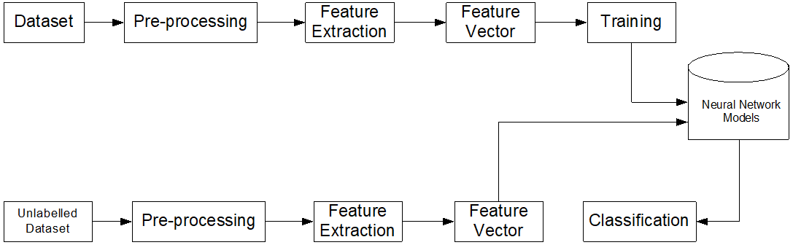
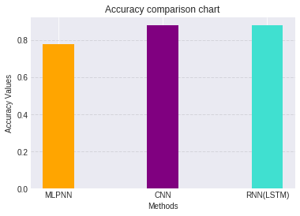

# Sentiment-Analysis-Youtube-Comments
Comparison of Neural Network Models for Nostalgic Sentiment Analysis of YouTube Comments.

- This repository covers the article named <b> "Comparison of Neural Network Models for Nostalgic Sentiment Analysis of YouTube Comments" </b>.
- <b> Citation (APA): </b> Postalcioglu, S , Aktas, S . (2020). Comparison of Neural Network Models for Nostalgic Sentiment Analysis of YouTube Comments . Hittite Journal of Science and Engineering , 7 (3) , 215-221 . DOI: 10.17350/HJSE19030000191 

<h3> Abstract </h3>

 For this study Sentiment Analysis (SA) is applied for the music comments using different Neural Network (NN) Models. SA is commonly used for Natural Language Processing (NLP). With the help of NLP, the evaluations/tips about the future can be obtained by analyzing the correspondences and comments. The aim of the study is to draw conclusions from the comments made under the songs whether they are nostalgic.Data is captured using the YouTube Data API. Data extraction is done by entering the link of the song whose comments will be taken. CSV files are obtained and then labelled as nostalgic and non-nostalgic. Different neural network models as MLPNN (Multi-Layer Perceptron Neural Network),CNN (Convolutional Neural Network), RNN-LSTM (Recurrent Neural Network-Long Short-Term Memory) are applied for sentiment analysis. Their performances are analyzed.MLPNN,CNN,RNN-LSTM performance results are 78%,88%,88%, respectively. 

<h3> Dataset </h3>

 

[https://huggingface.co/datasets/Senem/Nostalgic_Sentiment_Analysis_of_YouTube_Comments_Data]

<h4> 1- Usage Youtube Data API </h4>

<h4> 2- Pulling Data From Youtube </h4>

<h4> 3- Before - After Preprocessing Dataset </h4>

 

<h3> System Architecture </h3>

 

 

<h3> Result </h3>
 
